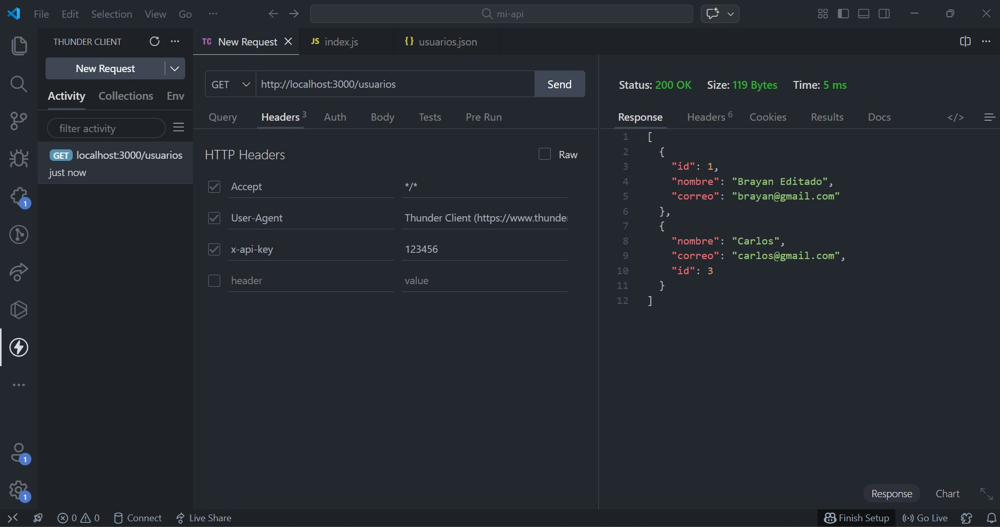
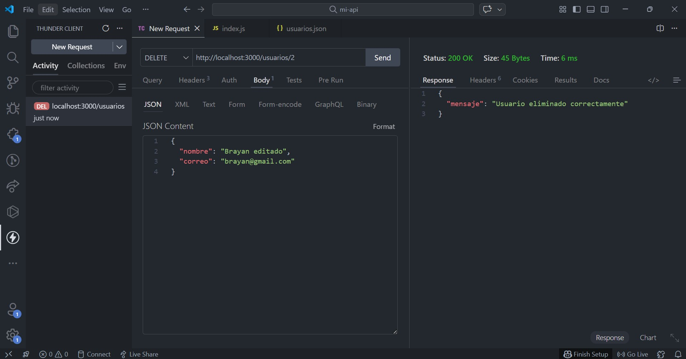
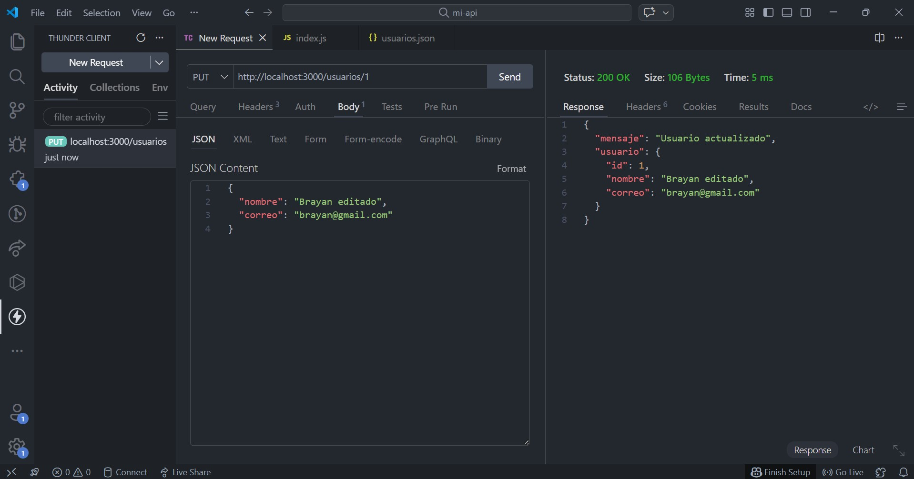

# API REST - Servicios Web

Proyecto académico desarrollado para la asignatura Servicios Web.

## 📌 Descripción

Se desarrolló una API REST utilizando Node.js y Express que permite gestionar usuarios mediante operaciones CRUD.

## 🚀 Tecnologías

- Node.js
- Express
- JSON (almacenamiento)
- Thunder Client / Postman

## 🔐 Seguridad

La API implementa autenticación mediante API Key.

Header requerido:

x-api-key: 123456

---

## 📡 Endpoints

### 🔹 GET /usuarios
Obtiene todos los usuarios

---

### 🔹 POST /usuarios
Crea un nuevo usuario

---

### 🔹 PUT /usuarios/:id
Actualiza un usuario existente

---

### 🔹 DELETE /usuarios/:id
Elimina un usuario

---

## ⚙️ Ejecución

1. Instalar dependencias:

npm install

2. Ejecutar servidor:

node index.js

3. Probar en Postman o Thunder Client

---

## 👨‍💻 Autor

Brayan Alexi Parra
